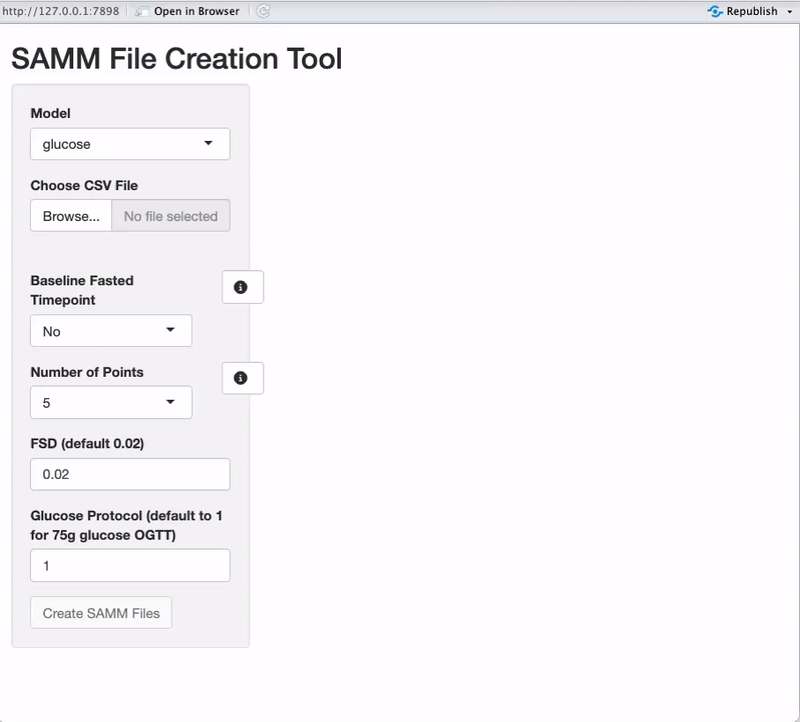
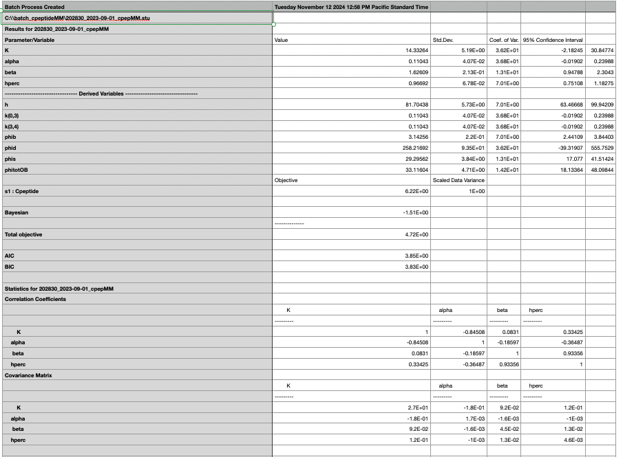
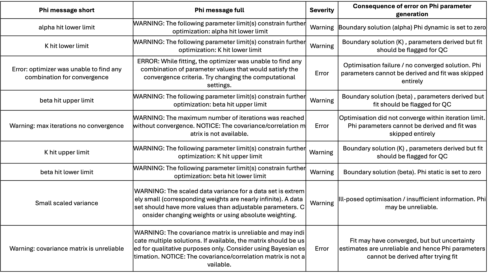
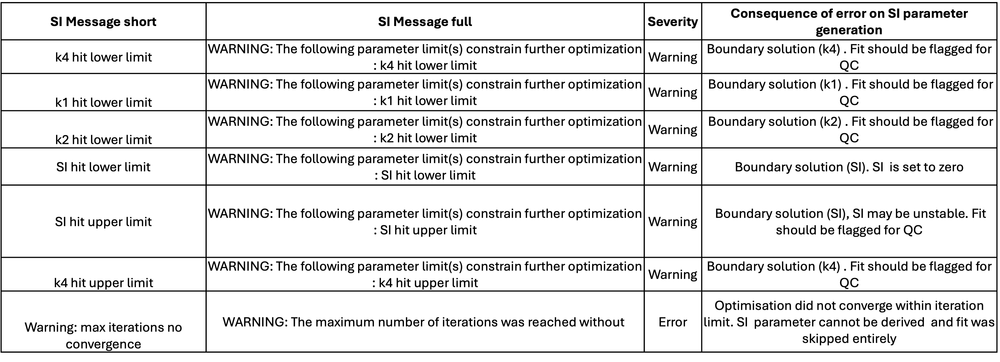

**OMMProcessing** is a repository containing two Shiny applications that support Oral Minimal Model (OMM) workflows using the **SAMM** software.

The repository is designed to support a practical end-to-end pipeline:

1.  Start with a study dataset containing OGTT-style glucose, insulin, and C-peptide values
2.  Generate one SAMM input file per observation (participant x visit)
3.  Run SAMM externally (batch processing)
4.  Convert SAMM’s text-based output into clean, analysis-ready results tables

> **Development status**\
> Both apps are under active development. Core functionality is implemented, but the user interface and model specification are still evolving.

------------------------------------------------------------------------

## How to run the apps

### 1) Clone or download the repository

Either clone using Git:

```{}
git clone https://github.com/<alicelouisejane>/OMMProcessing.git

```

Or download the repository as a ZIP from GitHub and unzip it.

### 2) Install required R packages

```{}
install.packages(c(
  "shiny", "shinyFiles", "shinyjs", "DT",
  "rio", "dplyr", "tidyr", "stringr", "stringi",
  "zip", "ggplot2", "gtsummary", "gt"
))
```

### 3) Run an app

Make sure your working directory is set to the repository root. From the repository root, run:

#### Create SAMM input files app

```{}
shiny::runApp("create_SAMM_files_app/app")
```

#### Extract SAMM results app

```{}
shiny::runApp("extract_SAMM_results_app/app")
```

## 
App 1: Create SAMM input files

### Overview

The Create SAMM Input Files Shiny application converts a single uploaded trial/cohort dataset (`.csv` or `.xlsx`) into SAMM-ready input files, generating one file per observation for batch execution in SAMM. This uploaded file is expected to be in a certain format and will have undergone preprocessing checks before uploading. See Required input data structure section for overview of data structure.

This tool is intended to reduce manual formatting and support reproducible, scalable SAMM workflows for large clinical trial and cohort datasets.

### Required input data structure

The uploaded dataset can contain as many rows (observations) as require but it must include the following variables using standard nomenclature:

-   `id`
-   `age_at_visit`
-   `bmi`
-   `weight`

OGTT variables must follow the naming conventions below:

-   `glu*`: Glucose
-   `cpep*`: C-peptide
-   `ins*`: Insulin

Where:

-   `m` indicates a negative timepoint (e.g., `m10` = -10 minutes)
-   numeric suffixes indicate OGTT sampling timepoints in minutes (e.g., `0`, `30`, `60`, `90`, `120`)

For example, valid column names include:

-   `glum10`, `glu0`, `glu30`, `glu60`, `glu90`, `glu120`
-   `insm10`, `ins0`, `ins30`, `ins60`, `ins90`, `ins120`
-   `cpepm10`, `cpep0`, `cpep30`, `cpep60`, `cpep90`, `cpep120`

An example input dataset is provided in this repository:

-   `test_data.csv`

```{r echo=F}
knitr::opts_chunk$set(
  message = FALSE,
  warning = FALSE
)
data<-head(rio::import("docs/test_data.csv"))
knitr::kable(data, format = "markdown")
```

### Mock up interface



#### Model

Choose which SAMM model input files to generate:

-   **glucose**: generates SAMM input files for the glucose minimal model (used to estimate insulin sensitivity).

-   **cpeptide**: generates SAMM input files for the C-peptide minimal model (used to estimate beta-cell responsiveness / Phi parameters).

In most workflows, both models are run separately in SAMM, so users typically generate both sets of input files.

#### Choose CSV file

Upload the cleaned trial/cohort dataset containing the required anthropometrics and OGTT variables.

-   Supported format: `.csv`

The uploaded dataset is displayed in the main panel for review.

#### Baseline fasted timepoint

Indicate whether your OGTT includes a fasted baseline sample collected **before** the 0-minute timepoint (e.g., a -10 minute sample).

-   **No**: assumes the earliest OGTT timepoint is 0 minutes

-   **Yes**: enables entry of a negative timepoint (e.g., `-10`)

This option affects how fasting values are derived and how the `STARTDATA` and `CONST` sections are populated in the SAMM input file. **Info button:**explains what a baseline fasted timepoint means and when it should be used.

#### Number of points

Choose the OGTT sampling schedule used in your dataset.

-   **5 points**: uses the default timepoints\
    `0, 30, 60, 90, 120`

-   **7 points**: uses the default timepoints

    `0, 10, 20, 30, 60, 90, 120`

-   **5 (custom)** or **7 (custom)**: allows the user to define their own OGTT timepoints.

**Info button:** describes the default schedules and how custom schedules work.

#### Custom timepoints (only for custom schedules)

If a custom schedule is selected, users must enter timepoints as a comma-separated list

Requirements:

-   Must contain exactly 5 or 7 timepoints (depending on selection) ie. `0, 15, 30, 60, 90`

-   The first timepoint must be `0`

-   Values must be numeric

A “Submit Timepoints” button becomes enabled once the custom schedule is valid.

**Info button:** describes the formatting requirements and validation rules.

#### Model-specific settings

**If model = glucose the app displays glucose-model specific settings:**

-   **FSD** (default `0.02`)\
    The fractional standard deviation used in the SAMM data weighting specification.

-   **Glucose protocol** (default `1`)

    Used to specify the glucose dose protocol (e.g., standard 75g OGTT).

**If model = cpeptide the app displays C-peptide-model specific settings:**

-   **GEN1** (default `2000`)

-   **GEN2** (default `0.001`)

-   **GEN3** (default `2`)These parameters control model settings for the C-peptide/Phi model template.

Once all required inputs are provided and valid, the **Create SAMM Files** button becomes enabled.

After successful generation, a **Download SAMM Files** button appears.

This downloads a `.zip` containing all generated SAMM input files for the selected model type.

### Example created SAMM file output

A SAMM file is a plain-text model specification that combines:

-   the **model structure** and solver settings
-   the **parameter definitions** (including bounds and initial values)
-   the **observation-level OGTT data**
-   the observation-specific **constants** required by the model

Current implementation outputs a `.txt` file which would then be converted to the appropriate file type for SAMM.

**See `docs/example_samm_input.txt` for a complete example of the SAMM output file structure**

In the example file:

-   The `MODEL / COMPDEF / COMPART / XFER / LOSS` blocks define the compartmental glucose model and its governing equations.
-   The `PARAM` blocks define parameters to be estimated (e.g., `SI`, `T`, `p1`), including starting values and bounds.
-   The `STARTDATA ... DATA ... END` section contains the observation-level OGTT data, where each row is a timepoint and each column is a measured variable (e.g., glucose `G` and insulin `I`).
-   The `CONST` lines at the bottom provide observation-specific constants such as:
    -   `BW` = body weight
    -   `Gss` = fasting glucose steady-state value
    -   `Iss` = fasting insulin steady-state value
    -   `D` = dose term (derived from body weight)

The Create SAMM Input Files app automates generation of these files by inserting the observation-specific `STARTDATA` and `CONST` sections for each row of an uploaded dataset.

> **Note:** The SAMM template and model specification used by this app are subject to change as the tool is developed (e.g., to support additional sampling schedules and model variants).

## App 2: Extract SAMM output

### Overview

SAMM generates model results as long, text-based output files for each observation.\
These output files typically include separate model runs for the **glucose model and** the **C-peptide model**

While these outputs contain all required information (parameter estimates, convergence information, fit diagnostics), the format is not directly usable for downstream statistical analysis, reporting, or merging back into a trial/cohort dataset.

This app provides an interface to convert SAMM output text files into clean, analysis-ready tables.

### Example from the SAMM output before processing

The app expects a separate raw (`.csv`) file output from the C-peptide model run and/or from the glucose model run, combining the processed results where both are present. All IDs ran in the SAMM batch will be output within this one `.csv` file. The verbose output from the C-peptide model for one ID file is below:



### Mock up interface

Users upload one or both raw SAMM outputs:

-   **Phi results** (C-peptide model output)

-   **SI results** (glucose model output)

After clicking **Process Data**, the app extracts key model outputs into a clean table (one row per observation) captures SAMM warning/error messages and generates QC flags as explained in detail in the next section.

Tabs across the top provides a quick summary of model failures, skipped runs, and zero-valued parameters and generates basic visualisations of parameter distributions.

A **Download Cleaned Results** button appears after processing, allowing export of the cleaned dataset.


### Example outputted analysis-ready table

The app produces a single combined results table (`.csv`) containing one row per observation (`id`).\
This table is designed to be merged back into the original trial/cohort dataset using `id`.

```{r echo=F}
library(rio)
library(dplyr)
library(knitr)
library(kableExtra)
knitr::opts_chunk$set(
  message = FALSE,
  warning = FALSE
)
table<-head(rio::import("docs/test_output.csv"))

knitr::kable(table, format = "markdown")
```

#### Model run status variables

The output includes variables indicating whether model estimation was attempted and whether it succeeded:

-   `phi_has_parameter`\
    Indicates whether the model successfully produced Phi parameter estimates.

-   `si_has_parameter`\
    Indicates whether the model successfully produced insulin sensitivity (SI) estimates.

-   `phi_is_skipped`, `si_is_skipped`\
    Indicates whether estimation was intentionally skipped (e.g., due to insufficient data or pre-specified model rules).

In downstream analyses, it can be useful to distinguish **skipped** runs from runs where estimation was attempted but failed. For example:

-   *Attempted Phi estimate but failed*\
    (`phi_has_parameter == FALSE` and `phi_is_skipped == FALSE`)

-   *Attempted SI estimate but failed*\
    (`si_has_parameter == FALSE` and `si_is_skipped == FALSE`)

#### Zero-value flags (convergence / boundary issues)

SAMM outputs may contain cases where parameters are set to zero due to convergence problems or boundary constraints.\
The extraction output includes flags for these cases, such as:

-   `phib_is_zero` (Phi basal set to 0)
-   `phid_is_zero` (Phi dynamic set to 0)
-   `phis_is_zero` (Phi static set to 0)
-   `phitotOB_is_zero` (Phi total set to 0)
-   `SI2_is_zero` (SI set to 0)

These flags allow users to quantify and report the frequency of optimisation failures or boundary solutions.

#### Parameter estimates and uncertainty

For each extracted parameter, the output includes:

-   estimated value (`*_value`)
-   standard deviation (`*_sd`)
-   coefficient of variation (`*_cv`)
-   confidence interval bounds (`*_ci_lower`, `*_ci_upper`)

Example extracted parameters include:

-   `phib` (basal beta-cell responsiveness)
-   `phid` (dynamic beta-cell responsiveness)
-   `phis` (static beta-cell responsiveness)
-   `phitotOB` (overall beta-cell responsiveness)
-   `SI2` (insulin sensitivity)

#### Warning/Error Messages

SAMM outputs commonly contain warnings and errors that indicate optimisation failure, boundary solutions, or unreliable uncertainty estimates. This app preserves the raw message text in `phi_message` (C-peptide / Phi model) and `si_message` (glucose / SI model) in addition to structured flags so that failure rates and boundary solutions can be summarised across large datasets.

These messages are generated by SAMM and may vary depending on model settings, solver options, and sampling schedules.

#### Phi model (C-peptide) messages



#### SI model (glucose) messages


